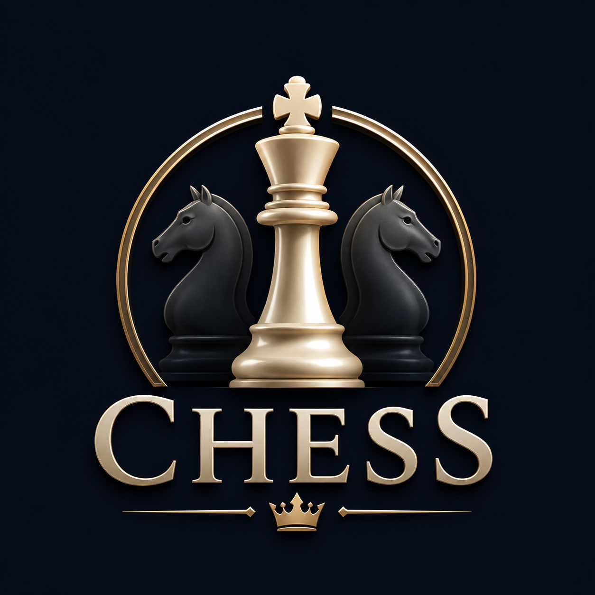
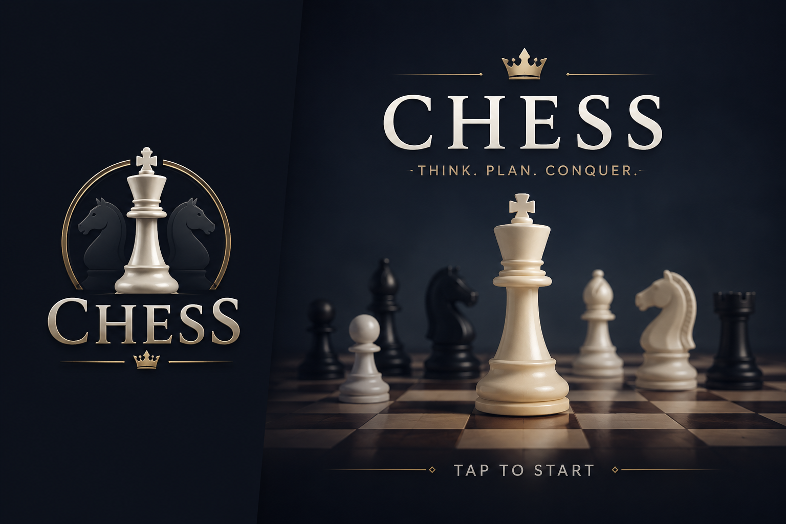

<p align="center">
  
</p>

<h1 align="center">Chess</h1>
<p align="center"><em>Think. Plan. Conquer.</em></p>

<p align="center">
  
  
  
</p>

A polished **3D chess game** built with **Godot 4.6 (.NET / C#)**, featuring a
world-class **Stockfish** opponent, full legal-move rules, and a clean
plain-English move history.

<p align="center">
  
</p>

## ▶️ Download & play (Windows)

Grab the latest build from the [**Releases**](https://github.com/Pieter1821/chess/releases) page:

1. Download **`Chess-Windows.zip`**
2. Unzip it anywhere
3. Double-click **`Chess.exe`**

No installation needed. Windows may show a "Windows protected your PC" warning for this
unsigned indie build — click **More info → Run anyway**.

## Features

- ♟️ **Full legal chess** — all piece movement, check, checkmate, stalemate, and
  draw rules (50-move, threefold repetition, insufficient material), plus pawn promotion.
- 🤖 **Stockfish 18 opponent** over the UCI protocol, with **Easy / Medium / Hard** skill levels.
- 🎥 **3D board** with an orbit / zoom / pan camera, smooth animated moves, and a captured-piece tray.
- 🟩 **Move & capture highlighting**, last-move-aware selection, and a **plain-English move list**
  (e.g. *"Pawn e2 to e4"*, *"Knight g1 takes e5"*) — readable by non-chess-players.
- ⏱️ HUD with your move count and clock, a turn/check indicator, an **Offer Draw** button,
  and a winner screen with instant restart.
- 🎨 Custom logo, boot splash, branded menu, move sound, and fullscreen support.

## Architecture

The rules live in a **pure-C# core** (`scripts/core/`) with **zero Godot dependency**, so the
whole engine is unit-tested in isolation:

```
scripts/core/      BoardState, MoveGenerator, Notation, ChessAi  (pure logic, tested)
scripts/board/     board rendering + click input
scripts/pieces/    piece spawning, selection, movement, capture
scripts/camera/    pivot-based camera rig
scripts/ui/        menu, HUD, move history
scripts/engine/    Stockfish UCI client
tests/             xUnit tests for the core
```

Presentation (scenes + node scripts) only renders the core's state and forwards input to it.

## Build & run

Requires the **.NET 8 SDK** and **Godot 4.6.3 (.NET build)**.

```bash
# 1. Get Stockfish (the AI) — it is not committed (GPL + large).
#    Download the Windows build and place it at:  engine/stockfish.exe
#    https://github.com/official-stockfish/Stockfish/releases

# 2. Build the C# project
dotnet build Chess.sln

# 3. Run the core tests
dotnet test tests/Chess.Core.Tests.csproj

# 4. Open the project in Godot and press Play (F5)
```

## Controls

| Action | Input |
|--------|-------|
| Select / move a piece | Left-click |
| Orbit camera | Right-drag |
| Pan camera | Middle-drag |
| Zoom | Mouse wheel |
| Reset camera | `R` |
| Toggle fullscreen | `F11` (Esc to exit) |

## Credits & licenses

- **Stockfish 18** — AI opponent, **GPLv3**. Source: https://github.com/official-stockfish/Stockfish
  The bundled `stockfish.exe` is the unmodified official build; per GPLv3 the source is at that link.
- **Chess piece models** — OpenGameArt, **CC0**.
- **Move sound** — Freesound community (verify the clip's license before public distribution).
- **Logo & splash art** — created by the project owner.
- **Godot Engine 4.6.3** — MIT.

Original game code © 2026 the project owner.

## Roadmap

- Castling & en passant
- Move-history click-to-jump, undo/redo, replay
- PGN / FEN export & import
- Settings menu (sound, language, board flip, coordinates)
- Android build (native ARM Stockfish)
